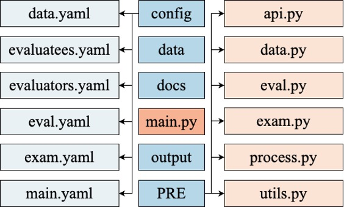
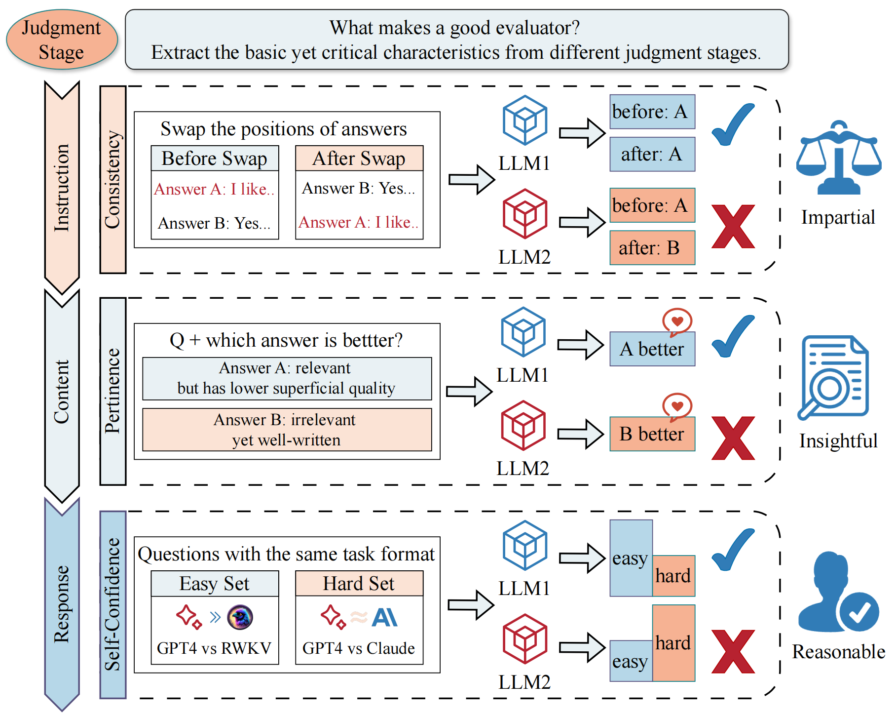

## Auto-RPE: An Automatic and Cost-Efficient Peer-Review Framework for Language Generation Evaluation

### Get Started

**Install nessary package:**

```bash
pip install -r requirements.txt
```

**Run specific example:**

```bash
python main.py --config config/main.yaml
```

### Code Structure

Following figure shows the structure of Auto-PRE. 



The "config" folder contains various parameter configuration files, managed in YAML format, which primarily consists of key-value pairs and supports data structures such as lists and dictionaries. In lists, elements are separated by hyphens ('-'), and in key-value pairs, keys and values are separated by a colon followed by a space (': '). The contents and functionalities of each configuration file are as follows:

1. 'main.yaml' is the top-level configuration file, setting parameters such as the task name to be tested, output paths, and organizing other YAML files responsible for various subsystems.
2. 'data.yaml' configures the data formats and paths for the tasks to be tested.
3. 'evaluatees.yaml' configures information about the large models to be tested, such as model names, paths, and account key information required for calling model APIs.
4. 'evaluators.yaml' configures information about the candidate evaluator large models, similar to the models being tested.
5. 'exam.yaml' sets various parameters for the evaluator qualification assessment subsystem, such as assessment modes, data sources for testing, and selection thresholds.
6. 'eval.yaml' sets the parameters for when evaluator large models perform evaluation tasks, including the strategy for integrating all evaluation results.

The "PRE" folder includes the main code parts of the system, with functionalities as follows:

1. 'api.py' defines the base class 'LLM_API' for large model API calls, with abstract methods 'init' and 'chat'. The former is used for initializing parameters such as the model name and path, and the latter for interacting with large models—inputting prompts and receiving outputs. Subsequently, 'api.py' is extended by different large models to implement 'init' and 'chat' methods tailored to their specific features. Lastly, 'api.py' also defines the 'Auto_API' class for managing and distributing APIs, facilitating easy API calls based on model names.
2. 'data.py' defines the 'DataLoader' class for loading data in various formats from specified paths. 'utils.py' integrates common functions such as formatted output.
3. 'eval.py' corresponds to PRE's peer review and chair decision subsystems, where 'EvalDataLoader' loads prompts for evaluation tasks, feeding them to the evaluator large models; 'PEER_REVIEW' guides these models in performing the evaluation tasks; 'PRE', the top-level class, uses the first two classes to collect results from the evaluator models and integrates them according to a predefined strategy.
4. 'exam.py' pertains to PRE’s evaluator qualification assessment subsystem, where 'EXAM' executes the qualification assessments, with functionalities such as 'init' for initializing various parameters, 'load_exam_prompts' for loading prompts for qualification tests, 'calculate_metric' for computing metrics for final selection, and 'conduct_exam' for performing the assessments and returning a list of qualified evaluator models.
5. 'process.py' is responsible for orchestrating the entire PRE system, starting by loading the dataset for the task to be tested, then collecting answers from the test model to build a set of answers to be evaluated, followed by conducting qualification assessments on the candidate evaluator models, using qualified models to evaluate the test answer set, and finally integrating all evaluator models' results to derive the test model’s scores and rankings.

### Core Part

Our automatic qualification exam is represented by 'exam.py'. Following figure shows the framework of our exam.



We extract the basic yet critical characteristics from different judgment stages based on previous research and experimental observations:

(1) Consistency: Upon receiving **the judgment instruction**, the evaluator should have no preset biases to ensure the objectivity and consistency; 

(2) Pertinence: When **judging the specific content**, the evaluator is expected to have a thorough understanding of the task and identify the core factors that truly impact the quality of the answers (e.g., pertinence to given question), rather than relying solely on secondary or superficial factors;

(3) Self-Confidence: After providing the **judgment response**, evaluators should have a reasonable level of confidence to reflect the reliability. 

Experiment results on three tasks, summary generation, non-factoid question-answering, and dialogue generation, indicate that our Auto-PRE can achieve state-of-the-art performance at a much lower cost.

### Reproduce
To quickly reproduce the results of our paper, you can run the code in the quick_reproduce directory.